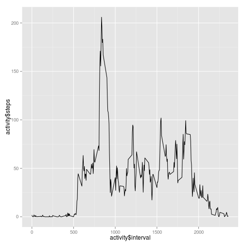
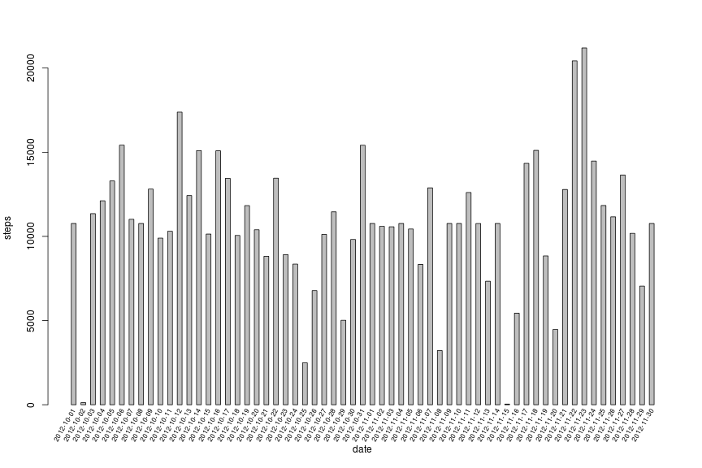

# Reproducible Research: Peer Assessment 1


## Loading and preprocessing the data


```r
activity <-read.csv("activity.csv", colClasses=c("integer", "Date", "integer"))

#activity <- activity[!is.na(activity$steps),]
```


## What is mean total number of steps taken per day?

The following figure shows the total number of steps per day

```r
totalStepsPerDay <- aggregate(steps ~ date, data = activity,
          FUN = sum) 

barplot(totalStepsPerDay$steps, ylab="Total number of steps per day", xlab="date", space=1)

text(seq(1.5,2*length(totalStepsPerDay$date),by=2), par("usr")[3], 
     srt = 60, adj= 1, xpd = TRUE,
     labels = totalStepsPerDay$date, cex=0.7)
```

 

The average number of steps per day is:

```r
mean(totalStepsPerDay$steps)
```

[1] 10766


Median number of steps per day

```r
median(totalStepsPerDay$steps)
```

[1] 10765

## What is the average daily activity pattern?

The following figure illustrates the average number of steps taken, averaged across all days (y-axis) per 5-minute interval.


```r
library(ggplot2)

qplot(activity$interval, activity$steps, geom="line", stat="summary", fun.y=mean, xlab="5 minuttes time interval", ylab="Number of steps per 5 mins time interval")
```

```
## Warning: Removed 2304 rows containing missing values (stat_summary).
```

 

The following calculates the 5-minute interval, on average across all the days in the dataset, which contains the maximum number of steps:

```r
averageStepsPerInterval <- aggregate(steps ~ interval, data = activity,
          FUN = mean)
averageStepsPerInterval[which.max( averageStepsPerInterval$steps),1]
```

```
## [1] 835
```


## Imputing missing values

Below we describe a strategy for imputing missing data. The strategy used is to use the averageStepsPerInterval calculated previously and use this to look up average number of steps for time intervals not having a value. 

The number of missing steps values are:


```r
sum(is.na(activity$steps))
```

```
## [1] 2304
```


Below we will impute missing values with the mean of steps for the interval of the missing value.
The result is stored in "imputedActivity". 

For "calculating" the mean for a given interval we are using the previous result stored in "averageStepsPerInterval".


```r
imputedActivity <- activity
# The following will reassign NA steps values for a given time interval in imputedActivity to the average 
# value for the given time interval
imputedActivity$steps <-sapply(1:length(activity$steps), function(x){
  row <- activity[x, ]
  steps <- row[,1]
  interval <- row[, 3]
  if(is.na(steps)){
    # If the steps value is not set, then we set it to average steps value for the time interval.
    # We do this by looking up the value for the selected time interval in averageStepsPerInterval.
    averageStepsPerInterval[averageStepsPerInterval$interval==interval, 2]
  }else {
    # If the steps value is set, we just use it as it is.
    steps
  }
})
```

Total number of steps per day for imputed data


```r
totalStepsPerDayImputed <- aggregate(steps ~ date, data = imputedActivity,
          FUN = sum) 

barplot(totalStepsPerDayImputed$steps,  ylab="steps", xlab="date", space=1)

text(seq(1.5,2*length(totalStepsPerDayImputed$date),by=2), par("usr")[3]-0.25, 
     srt = 60, adj= 1, xpd = TRUE,
     labels = totalStepsPerDayImputed$date, cex=0.7)
```

 

Average number of steps per day for imputed data. As can be seen it is the same as for non imputed data.


```r
mean(totalStepsPerDayImputed$steps)
```

[1] 10766


Median number of steps per day for imputed data. It is now the same as the mean. I.e. it differs a litle from non imputed data.


```r
median(totalStepsPerDayImputed$steps)
```

[1] 10766


## Are there differences in activity patterns between weekdays and weekends?

The graphs below shows the average number of steps taken during the time intervals of weekends
compared to weekdays. The graphs shows that the tested individual, on average and per time interval, took more steps during weekends than during weekdays.

In the graphs below we have used the non imputed data.


```r
activity$day <- as.factor(ifelse(weekdays(activity$date, TRUE)=="Sat"|weekdays(activity$date, TRUE)=="Sun", "WEEKEND", "WEEKDAY"))

activity$day <- factor(activity$day, levels = c("WEEKEND", "WEEKDAY"))

library(ggplot2)

qplot(interval, steps, data=activity, geom="line", stat="summary", fun.y=mean, xlab="5 minuttes time interval", ylab="Number of steps per 5 mins time interval") +     facet_wrap(~ day, scales="free", ncol=1)
```

```
## Warning: Removed 576 rows containing missing values (stat_summary).
## Warning: Removed 1728 rows containing missing values (stat_summary).
```

 

